# Контекст

Репозиторий содержит раскладку для клавиатуры [ZSA Moonlander Mark I](https://www.zsa.io/moonlander) и является вилкой раскладки Ильи Шепрута (https://github.com/optozorax/moonlander), про которую можно прочитать по [ссылке](https://optozorax.github.io/p/my-keyboard-layout/).

# Как прошить

Инициализируем модули в этом репо:

```bash
git submodule update --init --recursive
```

Если вы попробуете скачать исходный код вашей раскладки, сделанной на Oryx, то она будет работать только с [форком QMK от ZSA](https://github.com/zsa/qmk_firmware) и на моей ветке [firmware20](https://github.com/vic-by/zsa_qmk_firmware/tree/firmware20) с [изменениями нажимать любой код](https://github.com/klavarog/arbitrary_keycode) (устраняет [ошибку компиляции](https://github.com/klavarog/arbitrary_keycode/blob/a401df140104b9d70306e12c7fde471148fa164e/include.h#L3) которую теперь можно закомментировать):

```bash
git clone -b firmware20 https://github.com/vic-by/zsa_qmk_firmware.git zsa_qmk
cd zsa_qmk
./util/qmk_install.sh
git submodule init
git submodule update
```

Затем нужно создать символьную ссылку на папку с вашей раскладкой. Делать именно символьную ссылку нужно, чтобы не хранить свою раскладку где-то в дебрях этого форка QMK:

```bash
ln -s /absolute/path/to/moonlander zsa_qmk/keyboards/moonlander/keymaps/optozorax
```

Чтобы прошить, нужно внутри этого форка вызвать такую команду:

```bash
сd zsa_qmk
make moonlander:optozorax:flash
```

# Установка софтварных штук

## MacOS

Для работы юникодного слоя:
1. Скопировать файл `MacXCompose.dict` в `~/Library/KeyBindings/DefaultKeyBinding.dict`.
1. Перезагрузить компьютер.

Для работы переключения между окнами:
1. Установить [Karabiner-Elements](https://karabiner-elements.pqrs.org/), настроить его.
1. Установить [goku](https://github.com/yqrashawn/GokuRakuJoudo): `brew install yqrashawn/goku/goku`.
1. Скопировать файл `karabiner.edn` в `~/.config/karabiner.edn`.
1. Выполнить команду `goku`. Должно вывестись `Done!`.
1. Изменения автоматически подтянутся без перезагрузки и прочих действий.

# Слои

## Зоны пальцев

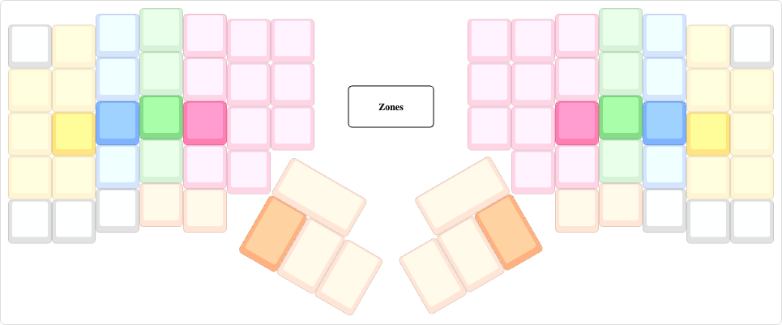

[Ссылка](https://kle.klava.org/#/gists/337191ca7166c6cb93781f50f71181ca)

## Объяснение аккордов 

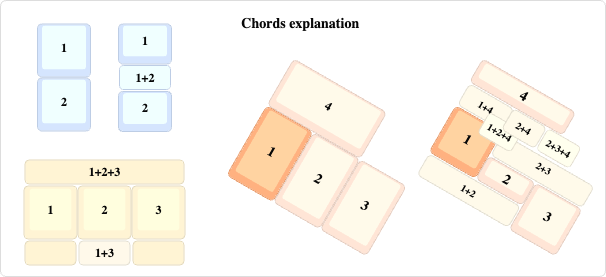

[Ссылка](https://kle.klava.org/#/gists/2c45a0b833ca272d7b94fdc66a668af7)

## Базовый слой

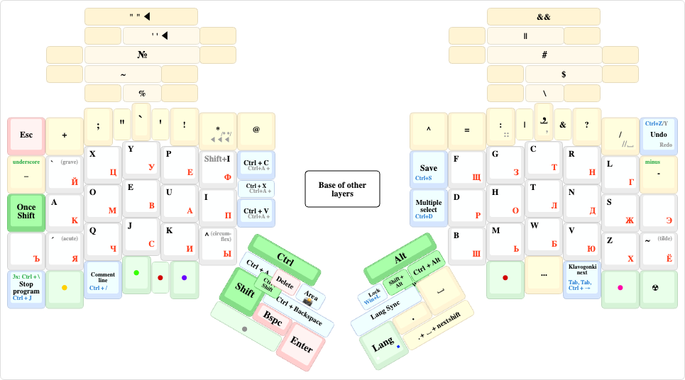

[Ссылка](https://kle.klava.org/#/gists/9a4b993ea6bff1ff0f9b7a33bc755623)

## Английский язык

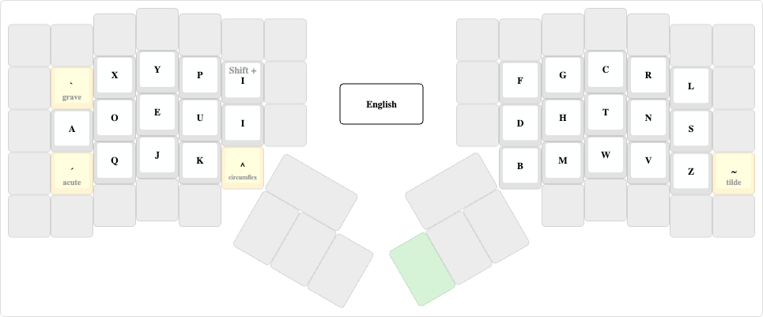

[Ссылка](https://kle.klava.org/#/gists/91178524f9e3273d73aec89aefab0ab0)

## Русский язык

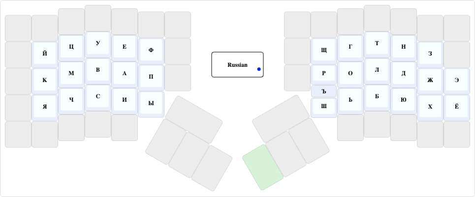

[Ссылка](https://kle.klava.org/#/gists/07c65db22ed9614664a2eb42cf88ef1f)

## Красный слой (стрелочки и скобки)

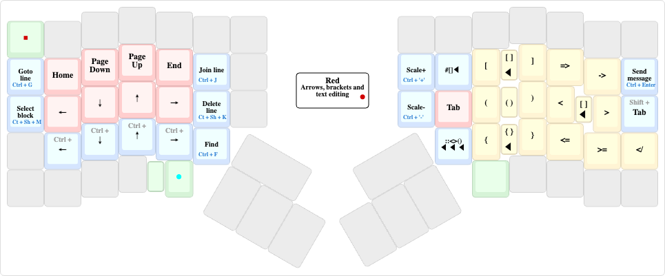

[Ссылка](https://kle.klava.org/#/gists/2e94ef1a8f6616e655bfc218fcda885e)

## Зеленый слой (браузер, медиа, функуиональные клавиши (Fx) )

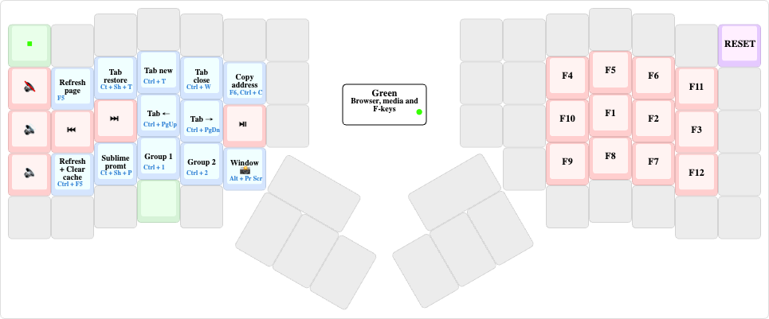

[Ссылка](https://kle.klava.org/#/gists/0611ab0f9b2546eb385ccd9c35e18782)

## Фиолетовый слой (приложения, цифры)

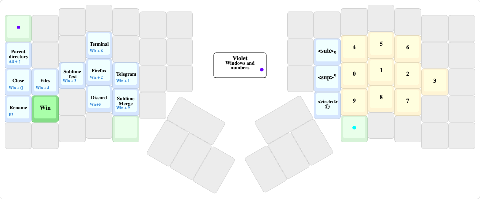

[Ссылка](https://kle.klava.org/#/gists/b6323946c89a4dd6b0c5c29c0531132a)

## Серый слой (мышь)

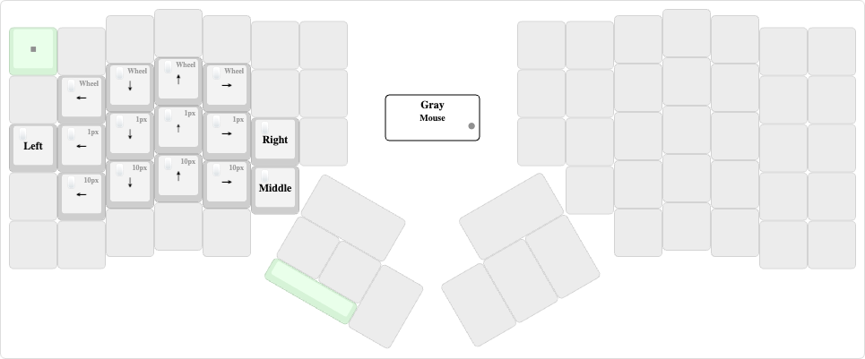

[Ссылка](https://kle.klava.org/#/gists/7c53a86d600e8b9bfd1f41a75c80f1c8)

## Голубой слой (юникод, иконки)

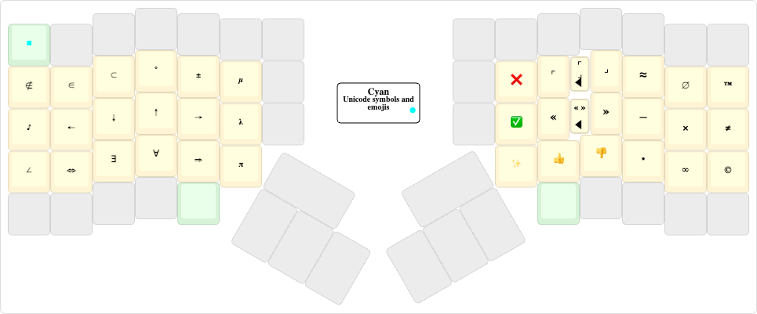

[Ссылка](https://kle.klava.org/#/gists/2b2ed5c6652c3e3027a01e35f4be4775)

## Жёлтый слой (RGB)

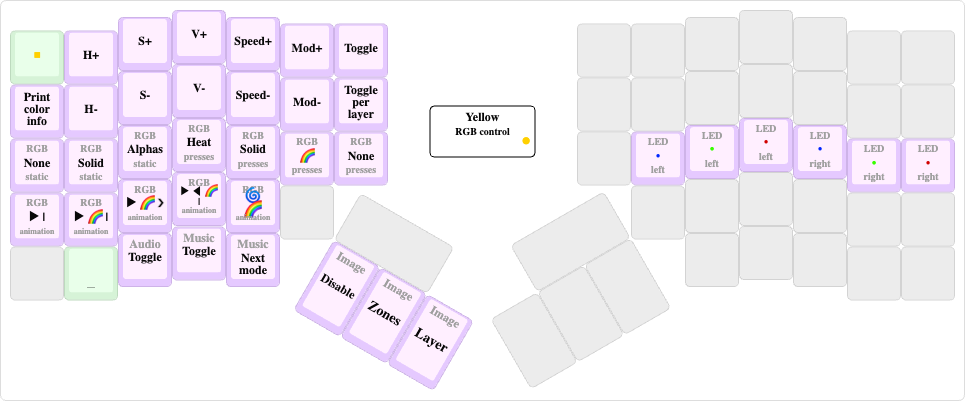

[Ссылка](https://kle.klava.org/#/gists/266a463f773aeb71fdd808377a9ea597)

## Розовый слой (игры)

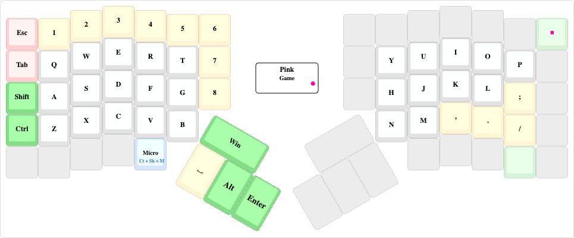

[Ссылка](https://kle.klava.org/#/gists/d119e7590b585c0c3a8706e953f40745)

## Слой на случай ядерной войны (все остальное)

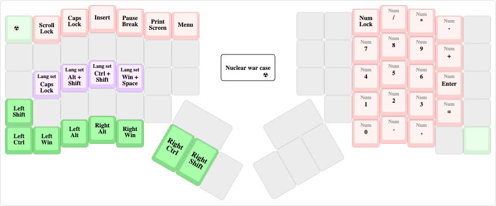

[Ссылка](ttps://kle.klava.org/#/gists/b6323946c89a4dd6b0c5c29c0531132a)